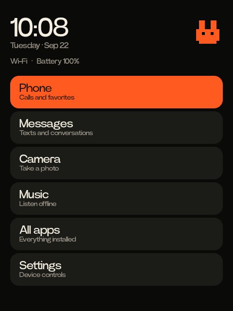

# Rabbit Phone

A small, Rabbit-inspired phone interface for the Rabbit R1. It runs on the
existing CipherOS 7.0 / Android 16 installation with the stock v0.8.293 kernel,
using a black canvas, warm white type, orange selection, and the physical wheel.
The tested display is 480 × 640 with a 190 dpi override.

## What it does

- Package: `com.kevtrinh.rabbitphone`; main activity: `.HomeActivity`.
- Native Java Android APIs only; no Gradle or external app dependencies required.
- Home gives direct access to Phone, Messages, Camera, Music and all apps.
- The wheel moves the highlighted selection and scrolls the app list with haptic
  ticks. The R1 wheel does not physically click; its side button selects instead.
- Phone/SMS are launched through standard intents and existing default apps.
  There are no automatic calls or sent messages.
- A built-in camera supports front/rear rotation, explicit photo capture, and
  privacy parking. Photos go to `Pictures/Rabbit Phone`.
- Hold-to-record voice notes stay in the app's private storage. Find and play
  them under **All apps → Utilities → Voice notes**. Recording stops on release,
  focus loss, or the 60-second limit. The app has no Internet permission.
- App list remains available; no packages removed or disabled.
- A narrow native input helper handles the power button only while this
  interface is foreground and unlocked. It has no network listener, arbitrary
  shell API, accessibility service, or permanent wakelock.

## Controls

| Input | Launcher | Built-in camera |
| --- | --- | --- |
| Wheel | Move selection / scroll, with haptics | Up: front; down: rear |
| Short side-button press | Open selected item | Take a photo |
| Double press | Open camera | Return to launcher |
| Hold, then release | Record and save a local voice note | Record and save a local voice note |
| Five quick presses | Refresh the local interface | Refresh preview |
| Eight quick presses | Power off | Power off |
| Tap rabbit icon | Standby clock; button then sleeps | — |
| Wheel/tap on standby clock | Return to app menu | — |

Normal Android wake/lock behavior remains available. Standalone Android apps
retain their own controls. The five-press action refreshes this local interface;
it does not reconnect to Rabbit's cloud. This project does not supply Rabbit's
cloud assistant or services.

## Build and install

The pinned toolchain manifest describes official Android SDK/NDK and Temurin
downloads for this macOS development environment. Downloads and extracted tools
live in the ignored `.toolchain/` directory (or `RABBIT_TOOLCHAIN_DIR`).

```sh
python3 scripts/prepare_toolchain.py
python3 scripts/check.py
python3 scripts/build.py
```

The APK is `build/rabbit-phone.apk`. Keep `.local/local-build.keystore` private:
its signing identity is required to update the installed app without removing
its data. Firmware images, signing keys, recordings, toolchains, and per-device
recovery files are deliberately outside version control.

Device scripts select one connected Rabbit R1, or use `RABBIT_ADB_SERIAL`.
Deploy only after building and reviewing the change. The helper requires the
tested owner-unlocked, userdebug installation with ADB root; it is not a generic
Android button-remapping app.

```sh
python3 scripts/device_profile.py backup
python3 scripts/install_app.py
python3 scripts/install_hardware.py install
python3 scripts/verify_reboot.py
```

The app installer grants Camera and Microphone permission for the corresponding
user-initiated features and sets **Rabbit Phone** as the default Home app.
The profile script applies dark mode, focused Quick Settings, the supported
camera shortcut, and the user's New York time zone; review that profile before
using it on another device.

## Recovery

The helper binary is stored under `/data/local/rabbit-phone`. Its startup entry
is appended to the existing allocated block of `/system/etc/init/init-debug.rc`
because this ROM's system image cannot allocate new files. The installer backs
up the exact original, checks hashes, and returns `/` to read-only. No boot image
or kernel is modified. Backups in `evidence/` are local, ignored, and required for
rollback; retain them independently of Git.

```sh
python3 scripts/install_hardware.py remove
python3 scripts/device_profile.py restore
```

Rollback restores the original startup file, system settings and Cipher launcher.
It leaves app data, including voice notes, intact. It refuses to overwrite a
startup file changed outside the recorded installation.

The helper releases its input grabs on client disconnect, failure, or a
three-second missing UI heartbeat. Android's original power behavior is then
available. The app reconnects while foreground after the helper returns.

## Verification and references



See [validation](docs/validation.md), [verified Android base](docs/base-system.md),
[hardware protocol](hardware/README.md), and
[development rules](AGENTS.md). Hardware-driver declarations alone are not
physical proof, and SIM calls/texts have not been carrier-tested.

- [Rabbit's documented controls](https://www.rabbit.tech/support/article/use-rabbit-r1)
- [CipherOS R1](https://cipheros.org.in/devices/r1)
- [Community hardware-workaround reference](https://github.com/frogmoses/rabbit-r1)
