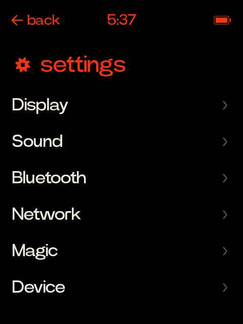
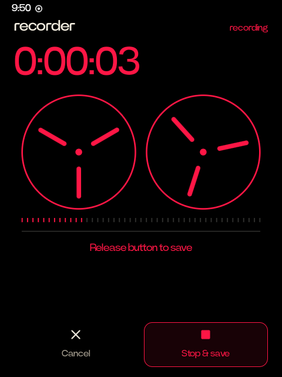
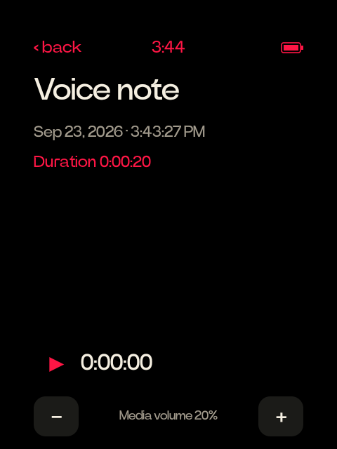
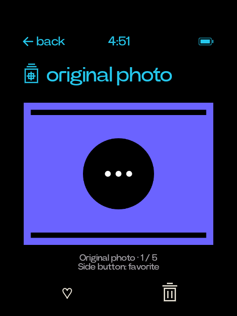

# Rabbit Phone

A small, Rabbit-inspired phone interface for the Rabbit R1. It runs on the
existing CipherOS 7.0 / Android 16 installation with the stock v0.8.293 kernel,
using a black Home screen, warm white type, colored app cards, and the physical wheel.
The tested display is 480 × 640 with a 190 dpi override.

The installed device can also use the owner's verified Power Grotesk font from
stock Rabbit firmware, a black/orange Android resource palette, and a matching
Home-and-lock wallpaper. The private font is never stored in this repository or
bundled in the Rabbit Phone APK; local ignored replacement APKs can contain it
for the owner's device.

## What it does

- Package: `com.kevtrinh.rabbitphone`; main activity: `.HomeActivity`.
- Native Java Android APIs only; no Gradle or external app dependencies required.
- Home shows the clock, battery and rabbit. The first wheel tick or upward swipe opens
  a rabbitOS 2-inspired card stack; the apps card keeps every installed phone app accessible.
- The catalog keeps its observed feature order while ordinary feature visits do
  not create a generic recent-card entry. An active card represents a real local
  task, such as a running timer; the legacy `opened_cards` ordering cache is not
  used. Top-edge swipe opens brightness, media volume,
  camera, keyboard, lock and settings; bottom-edge swipe returns Home.
- Home rises and fades as the stack comes into view. A selected card expands,
  holds briefly, then enlarges/fades into its feature. Back reveals the card
  before returning Home. Timing follows frame measurements from the official
  demo; exact easing and some source compositing remain unverified.
- The wheel browses the overlapping cards and app list with haptic
  ticks. The R1 wheel does not physically click; its side button selects instead.
- Phone/SMS are launched through standard intents and existing default apps.
  There are no automatic calls or sent messages.
- A built-in camera stays inside the Home window and supports front/rear rotation,
  explicit photo capture, and privacy parking. Photos go to `Pictures/Rabbit Phone`.
- The translator card opens a native language-pair setup screen. Its local chooser
  stores the pair; **Continue** opens Google Translate and does not claim to run
  Rabbit's translation backend.
- The Magic Gallery card opens a native local-photo gallery with a cyan header,
  Favorites row and three-column thumbnail overview. It reads only this app's
  original Camera photos from `Pictures/Rabbit Phone`; it has no storage
  permission, Internet access, cloud gallery, or magic/original-photo toggle.
- Holding the side button opens a reel-to-reel recorder inspired by Rabbit's
  Magic Recorder: red rotating reels, a real microphone level meter, elapsed
  timer and Power Grotesk type. Release saves a private voice
  note; the saved screen offers playback and the note library. Focus loss cancels
  an unfinished take, and the 60-second limit saves it automatically. The app has
  no Internet permission.
- The **beats** card catches short sounds and plays them in a beat. On that page,
  holding the side button records from the moment it's pressed, silences the beat,
  and on release trims and loudness-matches the catch before playing it over a
  synthesized thump. A click plays or stops, with no multi-press actions there. A
  touch pad catches too. Each catch is sorted (boom, snap, tick, tune or voice), voices are chopped into syllables and snapped to the grid, and missing drums are cut from your words. The wheel browses numbered beats; tempo and volume chips follow it too. Catches are kept in
  the app's external files folder; `scripts/pull_beats.py` backs them up outside Git.
  See [the Beats design](docs/beats.md) for the plan and what's built so far.
- The timer is native: choose a preset or custom duration, then use its live card
  to pause, resume, restart or cancel. The countdown persists across app restarts
  and device reboot. Android delivers the completion alert using the existing
  alarm sound and channel preferences, without changing media volume. One timer
  runs at a time; starting another replaces it.
- Settings has native Display, Sound, Network, Magic and Device pages, plus a
  Bluetooth shortcut. Wheel and side-button controls adjust brightness and media
  volume, select auto-sleep, and toggle system sound effects. Android owns the
  saved values; opening a page never replaces them with app defaults. Network,
  language and time panels return to their native parent on Back. Magic currently
  exposes the existing local Rabbit theme, not Rabbit cloud features.
- App list remains available; no packages removed or disabled.
- **apps → Utilities → Rabbit theme** previews and explicitly applies or
  removes the matching Home-and-lock wallpaper. Android's real keyguard,
  notifications, PIN and security behavior remain in charge of the lock screen.
- A narrow native input helper handles the power button only while this
  interface is foreground and unlocked. It has no network listener, arbitrary
  shell API, accessibility service, or permanent wakelock.

## Controls

| Input | Launcher | Built-in camera |
| --- | --- | --- |
| Wheel | Open the stack from Home, then browse with haptics | Up: front; down: rear |
| Short side-button press | Sleep on Home; open the selected card in the stack | Take a photo |
| Double press | Open camera | Turn camera off; return destination is a local policy |
| Hold, then release | Record and save a local voice note | Record and save a local voice note |
| Five quick presses | Refresh the local interface | Refresh preview |
| Eight quick presses | Power off | Power off |
| Swipe upward on Home | Open the card stack | — |
| Swipe down from top edge | Quick settings | Quick settings |
| Swipe up from bottom edge | Return Home | Return Home |

The **beats** page claims the side button while it's open: a hold catches a sound
instead of opening the recorder, a click plays or stops right away, and double,
five- and eight-press actions don't apply. Leave the page to use them again.

The recorder and camera stay inside the Home window, so holding the
button keeps its input connection until release. In the recorder, the wheel
moves between actions with haptics and a short side-button press selects one.
Saved notes are available from the **recorder** card and **apps → Utilities → Voice notes**.
Playback starts only when selected. Leaving the app, locking it or losing the
hardware connection stops playback and discards an unfinished recording.
The native library uses a red header and borderless **Voice note** rows with the
real saved date and a chevron. `+` opens the ready recorder without starting the
microphone; a row opens a quiet detail view with the actual duration and
Play/Stop, and Back returns to the library. Existing recording and saved reel
screens remain in place, and recorder volume settings are preserved.
Saved notes and the library include **−/+ media-volume controls** and a current
level. Select them with the wheel and side button, or tap them. A zero or muted
level says **Media volume off**; Play respects that setting. Adjusting the volume
stays inside the recorder, so it does not open a system panel or stop playback.
Android persists the selected level for each output device, including zero.
The app does not restore a startup default or keep a competing volume cache, so
reopening the recorder respects changes made elsewhere in Android as well.

The reels follow real recording/playback time and stop in the saved state.
Playback has its own position indicator; the recording meter uses actual
microphone samples. Reduced-motion settings keep the reels still while the
timer, level meter and playback position remain usable. Wheel selection stays
instant; touch presses and save feedback use short, interruptible transitions.

Normal Android wake/lock behavior remains available. Standalone Android apps
retain their own controls. The five-press action refreshes this local interface;
it does not reconnect to Rabbit's cloud. This project does not supply Rabbit's
cloud assistant or services. The keyboard shortcut searches installed apps; cloud
cards open their public service in the browser. Android feature screens and
static previews remain differences from Rabbit firmware; see the [navigation
reference and parity status](docs/navigation-parity.md).

The optional Assistant profile also opens the recorder from standby or another
app with one continuous side-button hold. Android handles the long press and
normal unlock; recording starts only once the recorder is visible and unlocked,
then releasing the button saves the note. With a credential lock, Android still
requires authentication. Releasing before the recorder opens leaves it ready for
a fresh hold. **Done** returns to the previous app.

This entry point uses Android's Assistant role and long-press setting. The helper
observes that original release without grabbing it, so Android receives the full
press. Normal foreground controls resume afterward. It does not keep a background
power-button grab, disable keyguard, or change Emergency SOS settings.

## Build and install

The pinned toolchain manifest describes official Android SDK/NDK and Temurin
downloads for this macOS development environment. Downloads and extracted tools
live in the ignored `.toolchain/` directory (or `RABBIT_TOOLCHAIN_DIR`).

```sh
python3 scripts/prepare_toolchain.py
python3 scripts/check.py
python3 scripts/build.py
```

The APK is `build/rabbit-phone.apk`. Keep `.local/local-build.keystore` private:
its signing identity is required to update the installed app without removing
its data. Firmware images, signing keys, recordings, toolchains, and per-device
recovery files are deliberately outside version control.

Device scripts select one connected Rabbit R1, or use `RABBIT_ADB_SERIAL`.
Deploy only after building and reviewing the change. The helper requires the
tested owner-unlocked, userdebug installation with ADB root; it is not a generic
Android button-remapping app.

```sh
python3 scripts/device_profile.py backup
python3 scripts/install_app.py
python3 scripts/install_hardware.py install
python3 scripts/assistant_profile.py apply
python3 scripts/verify_reboot.py
```

The app installer grants Camera and Microphone permission for the corresponding
user-initiated features and sets **Rabbit Phone** as the default Home app. It also
grants system-settings access for the explicit brightness slider, saving the
previous grant in ignored `evidence/navigation-write-settings-before.json`.
Timers add notification permission and exact-alarm access; the prior exact-alarm
mode is saved in `evidence/timer-exact-alarm-before.json`. Missing alarm or
notification access prevents a new timer from starting; recovery pauses an
existing running timer when reliable alert scheduling is unavailable.
Installation and opening quick settings do not change brightness or volume.
The Assistant profile selects the permission-protected custom recorder as Android's
assistant and changes long-press power from the power menu to that entry point.
It saves the original role and settings in a device-bound recovery journal. For
an existing helper installation, `python3 scripts/install_hardware.py update`
updates only its binary after checking the saved startup hash; it preserves the
previous binary and does not remount or rewrite system files.
The profile script applies dark mode, focused Quick Settings, the supported
camera shortcut, and the user's New York time zone; review that profile before
using it on another device.

The Rabbit visual profile is a separate, explicit operation. It installs no
Rabbit cloud service and does not turn third-party apps into pixel-identical
rabbitOS screens. Selected stock apps use local, same-certificate PackageInstaller
updates to carry Power Grotesk or finite readability fixes while preserving app
data. See [Theme and typography](docs/theme.md) for the private-font workflow,
system palette, tracked app updates, lock wallpaper and exact rollback order.

The Home mascot is a static native rendering, not Rabbit's idle 3D animation.
The owner may optionally install Rabbit's unchanged public user-guide PNG into
private app storage for this device only:

```sh
python3 scripts/install_mascot.py install
python3 scripts/install_mascot.py restore
```

The installer verifies the pinned official image before writing, keeps the
device-specific prior file outside Git, and restores it exactly. The image is
never bundled in the APK or committed to this repository.

## Navigation verification

The device checks exercise the visible UI and raw R1 wheel/power input paths:

```sh
python3 scripts/verify_navigation.py --device-test
python3 scripts/verify_card_flows.py --device-test --interruptions
python3 scripts/verify_active_cards.py --device-test
python3 scripts/verify_navigation_camera.py --device-test
python3 scripts/verify_quick_settings.py --device-test
python3 scripts/verify_settings.py --device-test
python3 scripts/verify_timer.py --device-test --reboot
python3 scripts/verify_timer.py --device-test --access-recovery
python3 scripts/verify_recorder_navigation.py --device-test
python3 scripts/build_gallery_harness.py
python3 scripts/verify_gallery.py --device-test
```

The card-flow check exercises Translator's language picker and the Translator,
Timer and Recorder Back paths. Its optional interruption checks temporarily slow
or disable Android animations, then verify restoration of both the stored
setting and the app's live animation rate. Build/install the current APK before
running those checks; its read-only navigation diagnostic is required. The camera check opens its preview without taking photos. The quick-settings
check temporarily changes brightness and volume, verifies restart persistence,
and restores its own changes. The native Settings check also exercises child Back
paths, overlay re-entry, Android panel return, sleep and sound-effect preferences;
it journals its own changes and restores them only while they still match the
test's values. The general navigation checks do not record audio or play personal notes. The full timer check sounds
one short completion alert and, with `--reboot`, briefly restarts the R1; it refuses
to overwrite an existing active timer. `--access-recovery` verifies wheel/button
selection and alarm-access loss without sounding an alert. Results and
screenshots remain under ignored `evidence/`; existing notes are hash-checked. The verifier discovers the R1 wheel device and
checks its supported Linux input keys before injection: `KEY_UP` (103) and
`KEY_DOWN` (108), not Android key-code numbers.

The earlier active-card and recorder fixture checks create only owned test data,
then cancel or remove it after checksum cleanup; original notes and volume remain
preserved. Their receipts are historical evidence and do not prove current v0.10
Gallery behavior.

The Gallery verifier passes 26 device checks. Its separate, same-signer
instrumentation APK creates three deterministic PNG fixtures, hashes
the existing camera photos, tests only fixture favorites and deletion, checks
generation/metadata guards and cleanup, then uninstalls itself. Production has no
debug fixture entry point.
See [navigation parity](docs/navigation-parity.md) for tested behavior and known
stock-rabbitOS differences.

## Recovery

The helper binary is stored under `/data/local/rabbit-phone`. Its startup entry
is appended to the existing allocated block of `/system/etc/init/init-debug.rc`
because this ROM's system image cannot allocate new files. The installer backs
up the exact original, checks hashes, and returns `/` to read-only. No boot image
or kernel is modified. Backups in `evidence/` are local, ignored, and required for
rollback; retain them independently of Git.

```sh
python3 scripts/assistant_profile.py restore
python3 scripts/install_hardware.py remove
python3 scripts/device_profile.py restore
```

Rollback restores the original startup file, system settings and Cipher launcher.
It leaves app data, including voice notes, intact. It refuses to overwrite a
startup file changed outside the recorded installation.

Theme rollback is deliberately separate from hardware rollback and has an
ordered recipe: restore tracked app APKs first, then the system-font transaction,
the color profile, and finally the wallpaper. SystemUI restoration is staged and
needs a reboot plus authoritative finalization. Follow the exact commands in
[Theme and typography](docs/theme.md); each step checks its device-bound backup.
Keep the ignored `evidence/` directory until rollback is no longer needed.

The helper releases its input grabs on client disconnect, failure, or a
three-second missing UI heartbeat. Android's original power behavior is then
available. The app reconnects while foreground after the helper returns.

## Verification and references



Version 0.11 expands the launcher to use the R1's 480×640 display: 432 px cards
and feature pages, 24 px side margins, larger Home artwork and clock, and a
full-height Quick Settings layout. The screenshots below predate that sizing
correction; private on-device evidence is kept outside Git.








See [validation](docs/validation.md), [theme and typography](docs/theme.md),
[verified Android base](docs/base-system.md), [hardware protocol](hardware/README.md), and
[development rules](AGENTS.md). Hardware-driver declarations alone are not
physical proof, and SIM calls/texts have not been carrier-tested.

The optional recorder device check deliberately makes a short microphone
recording and a second canceled take through the real PMIC input driver:

```sh
python3 scripts/verify_recorder.py --record-test
python3 scripts/verify_recorder.py --record-test --camera
python3 scripts/verify_assistant_recorder.py --record-test
python3 scripts/verify_assistant_recorder.py --record-test --from-app
```

Announce and authorize this media test before running it. It checks the active
microphone, release-to-save, valid AAC, starting a new take during playback,
cancellation on focus loss and preservation of existing notes. It plays only its
own test note and removes it afterward, without transcribing audio. Screenshots
and the verification receipt stay in ignored
`evidence/recorder/`.

The assistant check starts behind sleeping keyguard or in Settings, sends the
actual PMIC driver's held press, and requires Android itself to launch the
recorder. It verifies release-to-save, return to the previous app, ordinary
short-power sleep, and removal of its test audio. It never directly launches the
recorder or dismisses keyguard during the tested hold.

To diagnose playback without exporting existing recordings:

```sh
python3 scripts/probe_note_signal.py --analyze-notes
python3 scripts/verify_playback.py --play-note
```

The signal probe decodes on-device and returns only sample counts and level
statistics. The playback check deliberately plays an existing note on the R1,
checks mute indication, touch and hardware volume controls, speaker routing and
teardown, and restores the starting volume. It preserves all notes and writes
only local, ignored receipts/screenshots under `evidence/playback/`.

The volume persistence check uses the visible −/+ controls, restarts the app and
optionally reboots Android. It restores the initial level only if no external
volume change intervened, and does not play or record audio:

```sh
python3 scripts/verify_volume_persistence.py --change-volume --reboot
python3 scripts/verify_volume_persistence.py --change-volume --zero --reboot
```

Visual reference: [Rabbit's Magic Recorder](https://www.rabbit.tech/support/article/rabbit-r1-voice-recorder).
The reels and controls are native Canvas drawings; Rabbit's reference image is
not bundled. The local recorder retains this project's hold/release gestures
and does not add cloud transcripts, summaries, photos or bookmarks.

- [Rabbit's documented controls](https://www.rabbit.tech/support/article/use-rabbit-r1)
- [CipherOS R1](https://cipheros.org.in/devices/r1)
- [Community hardware-workaround reference](https://github.com/frogmoses/rabbit-r1)
