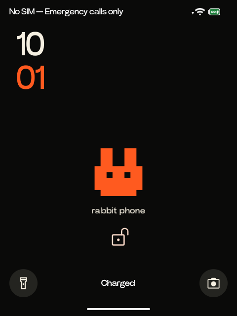

# Theme and typography

Rabbit Phone uses the real Android 16 lock screen and app stack, then gives them
a Rabbit-inspired visual system: Power Grotesk, near-black surfaces, warm white
text and Rabbit orange. It is not a rabbitOS clone, and it does not include
Rabbit's assistant, cloud services or proprietary launcher code.



## What changes

The theme uses several bounded mechanisms with separate receipts. They form one
coordinated visual stack, so rollback order matters even though each mechanism
has its own backup.

| Layer | Mechanism | Scope |
| --- | --- | --- |
| Rabbit Phone app | Loads a private `PowerGrotesk-Regular.otf` from its own files directory | Launcher, camera, theme screen and app dialogs |
| Android typography | Replaces bytes in two existing font allocations and updates three existing font XML files through a journaled transaction | Default sans families, realchoice sans and Cipher's clock family; existing aliases and language/emoji fallbacks remain |
| Android colors | Applies fabricated resource overlays and Android's dynamic-color settings | 98 system colors, the classic Holo action bar, lock-clock spacing and selected apps |
| Local app updates | Uses data-preserving, same-certificate PackageInstaller replacement sessions | SystemUI clock color, four bundled text fonts, and finite Contacts readability fixes |
| Wallpaper | Renders a local black bitmap with the orange Rabbit mark below the upper notification area | Home and Android lock wallpaper only |

The lock screen stays Android's genuine keyguard. PIN entry, biometric/security
policy, notifications and unlock behavior are not recreated or bypassed. The
wallpaper keeps the clock area clear and places the mark lower on the screen.

The system palette supplies dark surfaces and orange accents to apps that use
Android theme resources. Four packages also have finite, named overlays:

- Calendar: 58 color resources.
- Contacts: 42 color resources plus a reviewed orange floating-action-button drawable.
- Cipher Messaging: 7 color resources.
- F-Droid: 5 color resources.

Other apps inherit the system font, dark mode or dynamic palette only when their
own UI uses those Android resources. Hard-coded application colors, artwork and
web content remain the application's responsibility. Notes keeps its hard-coded
blue action, Weather keeps condition imagery, and remote pages keep their own
design. This is a cohesive device theme, not a promise that every third-party
pixel is recolored.

## Private Power Grotesk font

The verified source is `PowerGrotesk-Regular`, version 1.100, extracted from the
owner's [stock Rabbit firmware](https://github.com/rabbit-hmi-oss/firmware/releases/tag/v0.8.293). Its SHA-256 is:

```text
d6ad38cde62d42278205c5134c59a3b094d39d600e3bb42dc8c55d6241e1f343
```

Font binaries are ignored by Git (`*.otf` and `*.ttf`) and are never placed in
the public repository or Rabbit Phone APK. Locally built, ignored replacement
APKs can contain the font for the owner's device. Install the verified file into
Rabbit Phone's private app storage with:

```sh
python3 scripts/install_font.py /path/to/PowerGrotesk-Regular.otf
```

The app checks the private file at runtime and safely falls back to Android sans
if it is missing, unreadable or invalid.

System-wide typography uses a stricter two-step transaction. `prepare` records
device-bound backups and inode metadata, creates same-length replacements, and
runs the `FontProbe` raster test on Android before any system write. `apply`
requires that prepared state, stops Android, writes the five existing inodes in
place, verifies every hash and metadata record, returns `/` and `/product` to
read-only, then restarts Android.

```sh
python3 scripts/install_system_font.py prepare \
  --font /path/to/PowerGrotesk-Regular.otf \
  --transaction evidence/system-font-02

python3 scripts/install_system_font.py apply \
  --transaction evidence/system-font-02
```

The transaction never disables SELinux, adds a font file to the immutable
partitions, changes a boot image, or rewrites unrelated families. Keep the
ignored transaction directory: it is the only accepted source for restoration.

## Tracked app updates

Some apps bundle their own text font or hard-code a value outside Android theme
resources. `scripts/theme_apps.py` handles these as normal, root-owned
PackageInstaller replacement sessions signed with the same certificate as the
installed APK. It never uninstalls an app, clears its data, edits `/system`, or
bypasses package policy.

| Package | Local recipe | Current transaction |
| --- | --- | --- |
| `com.android.systemui` | Changes the one verified clock-color DEX string from lavender to warm white; installed with Android's supported staged-update path | `evidence/theme-apps/com.android.systemui` |
| `com.techyminati.pages` | Replaces `assets/flutter_assets/fonts/OPlusSans3-Light.ttf` with Power Grotesk; Flutter icon fonts remain intact | `evidence/theme-apps/com.techyminati.pages` |
| `com.bnyro.recorder` | Replaces the verified bundled text font `res/Ww.ttf`; icon fonts remain intact | `evidence/theme-apps/com.bnyro.recorder` |
| `com.dot.gallery` | Replaces the verified bundled text font `res/RV.ttf`; icon fonts remain intact | `evidence/theme-apps/com.dot.gallery` |
| `org.breezyweather` | Replaces the verified bundled text font `res/Gw.ttf`; weather icons and imagery remain intact | `evidence/theme-apps/org.breezyweather` |
| `com.android.contacts` | Adds explicit warm-white/orange colors to four compiled empty-state layouts and changes two verified ARSC style values, nine bytes total, without changing resource IDs or layout structure | `evidence/theme-apps/com.android.contacts-v2` |

The private Power Grotesk source must exist at
`evidence/theme/stock-fonts/PowerGroteskRegular.otf`. `capture` reads the
currently installed original APK and stores it as an immutable ignored backup.
`build` verifies each original entry hash before changing it. Contacts also
requires `scripts/build_theme_layouts.py`, which compiles and compares the four
binary XML trees before the APK build. The signing certificates and public AOSP
development keys are fetched from the [official Android source](https://android.googlesource.com/platform/build/+/refs/heads/main/target/product/security/),
checked against the installed signing identity, and cached privately.

The durable workflow for each package is:

```sh
# Run capture once per package; it refuses to overwrite an existing original.
python3 scripts/theme_apps.py capture --package PACKAGE

# Contacts only, before its build:
python3 scripts/build_theme_layouts.py

python3 scripts/theme_apps.py build --package PACKAGE \
  --build-dir build/theme-apks/TRANSACTION_NAME
python3 scripts/theme_apps.py prepare --package PACKAGE \
  --build-dir build/theme-apks/TRANSACTION_NAME \
  --transaction evidence/theme-apps/TRANSACTION_NAME
python3 scripts/theme_apps.py update --package PACKAGE \
  --transaction evidence/theme-apps/TRANSACTION_NAME
```

For the five ordinary apps, `update` completes only after the session disappears
and the installed hash, signature and version match the prepared APK. SystemUI
is different: `update` automatically creates a staged session and records
`READY`, which explicitly means the old APK is still installed. Reboot and then
finalize it:

```sh
python3 scripts/verify_reboot.py
python3 scripts/theme_apps.py finalize --package com.android.systemui \
  --transaction evidence/theme-apps/com.android.systemui
```

Finalization requires `APPLIED`, a changed boot ID, and the exact prepared hash,
signature and version. If a PackageInstaller result becomes uncertain, that
device/package is blocked until `settle` reconciles its recorded session; a
matching APK hash alone never resolves an outstanding intent.

## Color profile and boot behavior

The full profile backs up the original device settings, applies the 98-color
system palette, applies the four app overlays, changes the legacy Holo action
bar to black, and sets the SystemUI lock clock to `68.0dip` with line spacing
`1.0` for Power Grotesk. It also sets `lockscreen_use_double_line_clock=0`, which
keeps the compact clock from covering the wallpaper when no notifications are
visible. The clock adjustment is a finite local Java utility; it is not a
listener or resident process.

```sh
python3 scripts/theme_profile.py apply
```

`apply-apps` and `apply-clock` exist as focused repair commands, but a normal
first installation uses `apply`, which runs both. Overlay XML and rollback data
remain under ignored `evidence/theme/` and device-private storage.

SystemUI recreates dynamic overlays during boot, so the installed init entry
runs `theme/apply-at-boot.sh` once after Android reports boot complete. That
script reapplies only the reviewed palette, app overlays, legacy bar and clock
dimensions. If those dimensions change, it recreates the SystemUI process once,
then reapplies the palette. It makes at most three attempts and exits; it has no
network listener, wake lock, permanent process or open-ended retry loop. Restore
removes its enable marker and waits for the one-shot service to stop before
disabling overlays, which prevents a late boot retry from racing the rollback.

## Wallpaper

Open **All apps → Utilities → Rabbit theme** to see the actual wallpaper preview.
Nothing changes until **Apply Rabbit theme wallpaper** is pressed. The app then
renders the bitmap locally and applies it to Home and lock wallpaper together;
it does not replace or imitate keyguard.

Changing wallpaper can regenerate Android's dynamic colors. The complete palette
returns on the next boot, or after running `theme_profile.py apply` again.

## Recovery

Use the reverse dependency order below. The font, palette and replacement APKs
were designed and verified together; partially restoring them is a diagnostic
state, not a supported alternate visual theme. Every command refuses backups
from another R1.

**1. Restore local app APKs.** Restore the five non-staged packages from their
exact transactions:

```sh
python3 scripts/theme_apps.py restore --package com.techyminati.pages \
  --transaction evidence/theme-apps/com.techyminati.pages
python3 scripts/theme_apps.py restore --package com.bnyro.recorder \
  --transaction evidence/theme-apps/com.bnyro.recorder
python3 scripts/theme_apps.py restore --package com.dot.gallery \
  --transaction evidence/theme-apps/com.dot.gallery
python3 scripts/theme_apps.py restore --package org.breezyweather \
  --transaction evidence/theme-apps/org.breezyweather
python3 scripts/theme_apps.py restore --package com.android.contacts \
  --transaction evidence/theme-apps/com.android.contacts-v2
```

SystemUI restore is staged. `restore` must report `READY`; then perform a real
reboot and finalize the recorded session:

```sh
python3 scripts/theme_apps.py restore --package com.android.systemui \
  --transaction evidence/theme-apps/com.android.systemui
python3 scripts/verify_reboot.py
python3 scripts/theme_apps.py finalize --package com.android.systemui \
  --transaction evidence/theme-apps/com.android.systemui
```

**2. Restore the system font.** This returns the two font files and three font
XML files to their recorded bytes.

```sh
python3 scripts/install_system_font.py restore \
  --transaction evidence/system-font-02
```

**3. Restore the color profile.** This stops boot-time reapplication, disables
the Rabbit overlays, and restores the saved Android theme and clock settings.

```sh
python3 scripts/theme_profile.py restore
```

**4. Restore the wallpaper.** On the R1, open
**All apps → Utilities → Rabbit theme**, choose
**Restore Android default wallpaper**, then confirm. This clears the generated
Rabbit image from Home and lock wallpaper through Android's wallpaper service.

The private app font can remain installed after system-font restoration because
it affects Rabbit Phone only. Removing Rabbit Phone's app data removes that
private copy as part of Android's normal app-data lifecycle.

## Source-only boundary

The repository tracks the patch recipes, resource IDs, layout sources, pinned
hashes and verification code. It does not publish the stock Rabbit font,
captured APKs, modified APKs, Android signing-key material, app signing key,
device receipts or rollback binaries. Those stay under ignored `evidence/`,
`build/` and `.local/`. The same-certificate updates are produced locally for
the owner's device from its installed APKs; the source repository is not a
redistribution channel for Rabbit or third-party binary assets.
